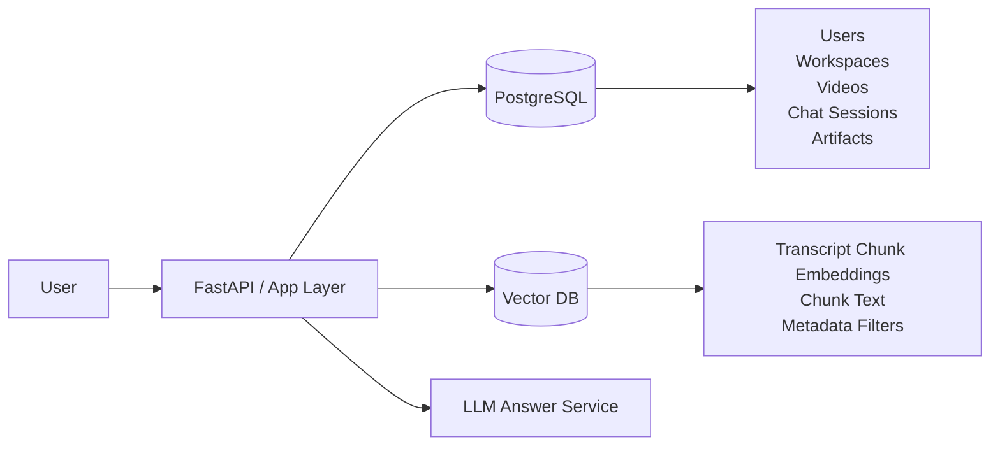
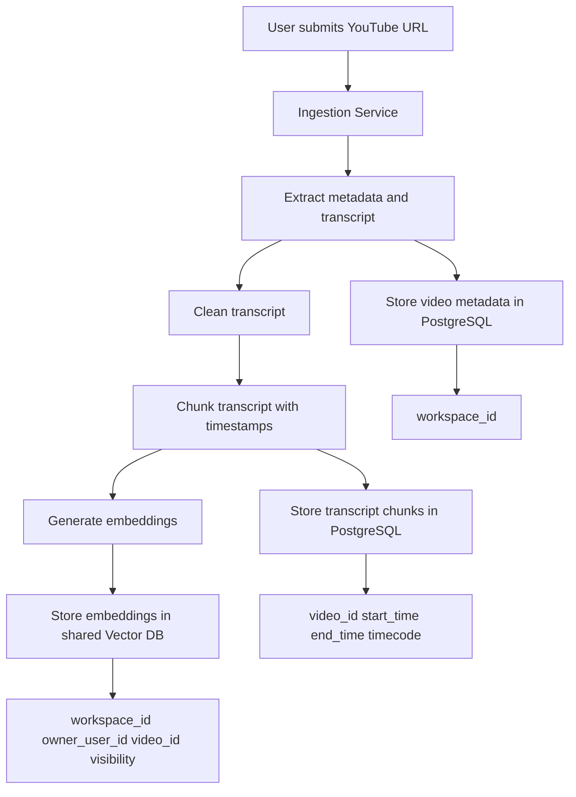
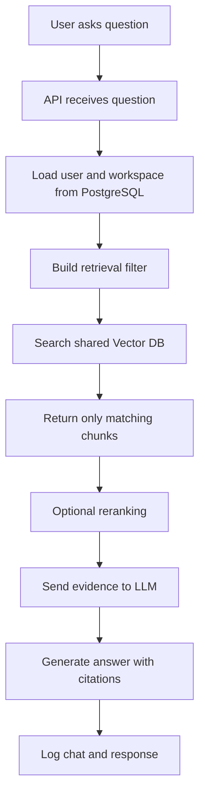
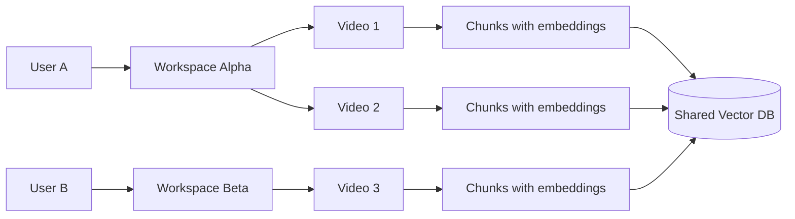

# Multi-User Flow Explained Visually

This document explains one key idea:

You do **not** create a separate vector database for each user.

Instead, you use:

- one shared vector collection for embeddings
- one PostgreSQL database for users, sessions, videos, and permissions
- metadata filters to make sure each user only sees allowed data

---

## 1. Big Picture



### Meaning

- `PostgreSQL` stores application data
- `Vector DB` stores searchable transcript embeddings
- the app layer checks who the user is before retrieval happens

---

## 2. Ingestion Flow

This is what happens when a user adds a YouTube video.



### Meaning

After one video is processed:

- PostgreSQL knows:
  - who uploaded it
  - which workspace it belongs to
  - what the chunk timestamps are
- Vector DB knows:
  - the chunk embedding
  - which workspace/user/video that chunk belongs to

So even though the vector DB is shared, every chunk still carries ownership metadata.

---

## 3. Query Flow

This is what happens when a user asks a question.



### Example retrieval filter

```json
{
  "workspace_id": "ws_123",
  "visibility": "private",
  "owner_user_id": "user_456"
}
```

This means:

- search only inside this workspace
- only retrieve chunks the user is allowed to see
- ignore chunks from other users or workspaces

---

## 4. Why One Shared Vector DB Works

Think of the vector DB like a **big library building**.

- Each chunk is a book
- The embedding is the shelf position
- Metadata is the access label on the book

You do **not** build a new library building for every person.

Instead, you keep all books in one place and say:

- this shelf belongs to workspace A
- this book belongs to user X
- only members of workspace A can read it

That is what metadata filtering does.

---

## 5. Simple Example with Two Users



### What the shared vector DB contains

```text
Chunk A -> workspace_id = Alpha
Chunk B -> workspace_id = Alpha
Chunk C -> workspace_id = Beta
```

When User A asks a question:

- search runs on the shared vector DB
- filter says `workspace_id = Alpha`
- User A gets only Alpha chunks

User A never sees Beta chunks.

---

## 6. What Goes Where

### PostgreSQL

Use PostgreSQL for:

- users
- workspaces
- workspace membership
- videos
- transcript chunk records
- chat sessions
- chat history
- generated study artifacts

### Vector DB

Use the vector DB for:

- chunk embeddings
- chunk text
- chunk metadata used during retrieval

---

## 7. Mapping to Your Current Schema

From your SQL schema:

- `users`: who is using the system
- `workspaces`: logical data boundary
- `workspace_members`: who can access that workspace
- `videos`: which source was uploaded
- `transcript_chunks`: source-of-truth chunk records
- `chat_sessions` and `chat_messages`: Q&A history
- `generated_artifacts`: flashcards, quizzes, summaries

The important bridge table is:

- `transcript_chunks`

Because each chunk has:

- `workspace_id`
- `owner_user_id`
- `video_id`
- `timecode`
- `vector_document_id`

That lets PostgreSQL and the vector DB stay connected.

---

## 8. Recommended MVP Rule

For your project, use this rule:

```text
One shared vector collection
+ metadata filters per workspace/user/video
+ PostgreSQL for permissions and app data
```

That is the cleanest design for a portfolio-ready RAG system.

---

## 9. If You Want To Make It Even Simpler

For a first version, you can reduce the model to:

- one app database
- one vector collection
- one filter: `user_id`

Then later upgrade to:

- `workspace_id`
- `visibility`
- `video_id`

That gives you a smooth path from MVP to a stronger architecture.
